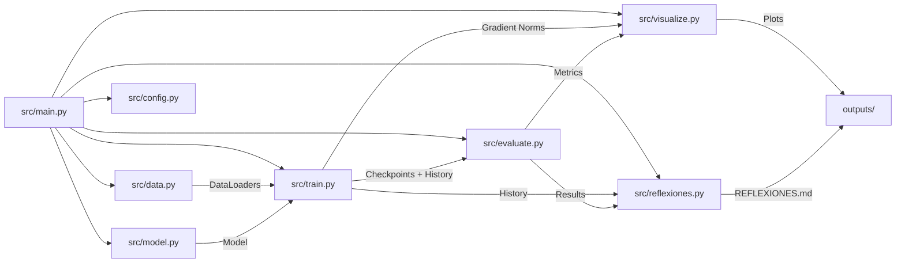
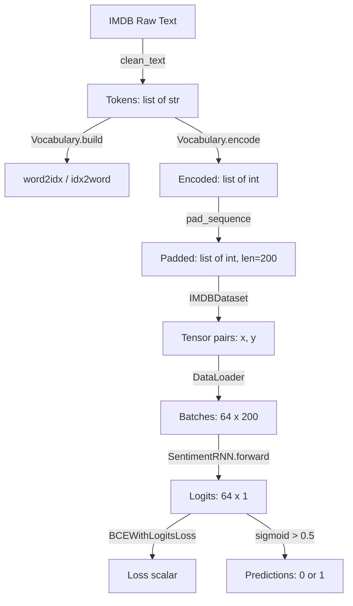

# Design

## Overview

El sistema se organiza como un pipeline modular de 6 etapas ejecutadas secuencialmente desde un punto de entrada único (`main.py`). Cada módulo es independiente y testeable, con una configuración centralizada en `config.py`. El modelo `SentimentRNN` es parametrizable para soportar LSTM y GRU con la misma interfaz, permitiendo comparación directa.

**Satisface:** REQ-9 (estructura modular), REQ-4 (modelo configurable), REQ-5 (entrenamiento reproducible)

## Architecture



### Flujo de Datos



### Estructura de Archivos del Proyecto

```
StackedRNN/
├── .venv/                 # Entorno virtual Python (excluido de git)
├── .gitignore             # Exclusiones de git (venv, __pycache__, etc.)
├── conftest.py            # Configuración de pytest (agrega src/ al path)
├── requirements.txt       # Dependencias pinned
├── src/                   # Código fuente del proyecto
│   ├── __init__.py
│   ├── config.py          # Hiperparámetros centralizados
│   ├── data.py            # Descarga, limpieza, vocab, DataLoaders
│   ├── model.py           # SentimentRNN (LSTM/GRU)
│   ├── train.py           # Loop de entrenamiento
│   ├── evaluate.py        # Evaluación y métricas
│   ├── visualize.py       # Generación de plots
│   ├── reflexiones.py     # Generación de REFLEXIONES.md
│   └── main.py            # Punto de entrada
├── tests/                 # Tests unitarios y de propiedades
│   ├── test_data.py
│   ├── test_model.py
│   ├── test_train.py
│   └── test_evaluate.py
├── outputs/               # Plots PNG generados
│   ├── training_curves.png
│   ├── confusion_matrices.png
│   └── gradient_norms.png
├── checkpoints/           # Mejores pesos guardados
│   ├── best_lstm.pt
│   └── best_gru.pt
└── REFLEXIONES.md         # Documento de reflexiones generado
```

## Components and Interfaces

### src/config.py
- **Purpose**: Centralizar todos los hiperparámetros y configuración del proyecto
- **Interface**:
  ```python
  SEED = 42
  VOCAB_SIZE = 25_000
  MIN_FREQ = 2
  MAX_LEN = 200
  EMBEDDING_DIM = 128
  HIDDEN_SIZE = 256
  NUM_LAYERS = 2
  RNN_DROPOUT = 0.3
  EMBED_DROPOUT = 0.5
  BATCH_SIZE = 64
  LEARNING_RATE = 0.001
  MAX_EPOCHS = 10
  PATIENCE = 3
  GRAD_CLIP_NORM = 5.0
  TRAIN_SIZE = 20_000
  VAL_SIZE = 5_000
  GRADIENT_MONITOR_STEPS = 100
  OUTPUT_DIR = "outputs/"
  CHECKPOINT_DIR = "checkpoints/"
  ```
- **Dependencies**: None
- **Satisface:** REQ-9.4, REQ-9.5

### src/data.py
- **Purpose**: Descarga, limpieza, vocabulario, padding y DataLoaders
- **Interface**:
  ```python
  def clean_text(text: str) -> str
  # Elimina HTML, lowercase, elimina puntuación, tokeniza
  # Satisface: REQ-1.2, REQ-1.3, REQ-1.4, REQ-1.5

  class Vocabulary:
      def __init__(self, min_freq: int, max_size: int)
      def build(self, tokenized_texts: list[list[str]]) -> None
      def encode(self, tokens: list[str]) -> list[int]
      word2idx: dict[str, int]
      idx2word: dict[int, str]
  # Satisface: REQ-2.1 a REQ-2.6

  def pad_sequence(encoded: list[int], max_len: int) -> list[int]
  # Satisface: REQ-3.1, REQ-3.2

  class IMDBDataset(torch.utils.data.Dataset):
      def __init__(self, encodings: list[list[int]], labels: list[int])
      def __len__(self) -> int
      def __getitem__(self, idx: int) -> tuple[Tensor, Tensor]
  # Satisface: REQ-3.6

  def get_dataloaders(batch_size: int, seed: int) -> tuple[DataLoader, DataLoader, DataLoader]
  # Orquesta todo: descarga, limpia, construye vocab, pad, split, DataLoaders
  # Satisface: REQ-1.1, REQ-3.3, REQ-3.4, REQ-3.5
  ```
- **Dependencies**: `datasets` (Hugging Face), `torch`, `config`

### src/model.py
- **Purpose**: Definición del modelo Stacked RNN configurable
- **Interface**:
  ```python
  class SentimentRNN(nn.Module):
      def __init__(self, vocab_size: int, embedding_dim: int, hidden_size: int,
                   num_layers: int, rnn_type: str, rnn_dropout: float,
                   embed_dropout: float)
      def forward(self, x: Tensor) -> Tensor
  # Satisface: REQ-4.1 a REQ-4.6

  def print_model_summary(model: SentimentRNN) -> None
  # Imprime arquitectura + parámetros por capa (siempre juntos)
  # Satisface: REQ-4.5
  ```
- **Dependencies**: `torch.nn`, `config`

### src/train.py
- **Purpose**: Loop de entrenamiento con early stopping, gradient clipping y monitoreo
- **Interface**:
  ```python
  def set_seed(seed: int) -> None
  # Fija seeds para torch, numpy, random, torch.cuda
  # Satisface: REQ-5.1, REQ-9.4

  def get_device() -> torch.device
  # Detecta CUDA > MPS > CPU, retorna device
  # Satisface: REQ-5.8, REQ-5.9

  @dataclass
  class TrainingHistory:
      train_losses: list[float]
      val_losses: list[float]
      train_accs: list[float]
      val_accs: list[float]
      gradient_norms: dict[str, list[float]]  # layer_name -> [norms]
      training_time: float
      epochs_trained: int

  def train_model(model: SentimentRNN, train_loader: DataLoader,
                  val_loader: DataLoader, device: torch.device,
                  model_name: str) -> TrainingHistory
  # Loop completo: forward, backward, clip, eval, early stop, save
  # Satisface: REQ-5.2 a REQ-5.7, REQ-7.3
  ```
- **Dependencies**: `torch`, `numpy`, `time`, `config`, `model`

### src/evaluate.py
- **Purpose**: Carga de checkpoints, predicción y cálculo de métricas
- **Interface**:
  ```python
  @dataclass
  class EvaluationResults:
      accuracy: float
      precision: float
      recall: float
      f1_score: float
      predictions: np.ndarray
      labels: np.ndarray

  def evaluate_model(model: SentimentRNN, test_loader: DataLoader,
                     device: torch.device, checkpoint_path: str) -> EvaluationResults
  # Carga pesos, eval mode, no_grad, genera predicciones y métricas
  # Satisface: REQ-6.1, REQ-6.2, REQ-6.3

  def print_comparison_table(lstm_results: EvaluationResults,
                             gru_results: EvaluationResults,
                             lstm_history: TrainingHistory,
                             gru_history: TrainingHistory) -> None
  # Tabla lado a lado con métricas y tiempos
  # Satisface: REQ-6.4, REQ-6.5
  ```
- **Dependencies**: `torch`, `numpy`, `sklearn.metrics`, `config`

### src/visualize.py
- **Purpose**: Generación de todas las visualizaciones comparativas
- **Interface**:
  ```python
  def plot_training_curves(lstm_history: TrainingHistory,
                           gru_history: TrainingHistory,
                           output_dir: str) -> None
  # Loss y accuracy superpuestas LSTM vs GRU
  # Satisface: REQ-7.1

  def plot_confusion_matrices(lstm_results: EvaluationResults,
                              gru_results: EvaluationResults,
                              output_dir: str) -> None
  # Heatmaps lado a lado
  # Satisface: REQ-7.2

  def plot_gradient_norms(lstm_history: TrainingHistory,
                          gru_history: TrainingHistory,
                          output_dir: str) -> None
  # Norma L2 por capa, steps 1-100
  # Satisface: REQ-7.3, REQ-7.4

  def save_all_plots(lstm_history, gru_history,
                     lstm_results, gru_results, output_dir: str) -> None
  # Orquesta todas las visualizaciones
  # Satisface: REQ-7.5
  ```
- **Dependencies**: `matplotlib`, `seaborn`, `numpy`, `sklearn.metrics`

### src/reflexiones.py
- **Purpose**: Generación automática del documento REFLEXIONES.md basado en resultados experimentales
- **Interface**:
  ```python
  def generate_reflexiones(lstm_history: TrainingHistory,
                           gru_history: TrainingHistory,
                           lstm_results: EvaluationResults,
                           gru_results: EvaluationResults,
                           output_path: str) -> None
  # Genera REFLEXIONES.md respondiendo las 8 preguntas con evidencia experimental
  # Satisface: REQ-8.1, REQ-8.2, REQ-8.3, REQ-8.4
  ```
- **Dependencies**: `train` (TrainingHistory), `evaluate` (EvaluationResults), `config`

### src/main.py
- **Purpose**: Punto de entrada que orquesta el pipeline completo
- **Interface**:
  ```python
  def verify_setup() -> bool
  # Verifica que todos los módulos y config existen
  # Satisface: REQ-9.3

  def main() -> None
  # 1. verify_setup()
  # 2. get_dataloaders()
  # 3. train LSTM → TrainingHistory
  # 4. train GRU → TrainingHistory
  # 5. evaluate both → EvaluationResults
  # 6. generate plots
  # 7. generate_reflexiones()
  ```
- **Dependencies**: Todos los módulos anteriores

## Data Models

### TrainingHistory
```python
@dataclass
class TrainingHistory:
    train_losses: list[float]      # Loss por época en train
    val_losses: list[float]        # Loss por época en validation
    train_accs: list[float]        # Accuracy por época en train
    val_accs: list[float]          # Accuracy por época en validation
    gradient_norms: dict[str, list[float]]  # {layer_name: [norm_step1, ...]}
    training_time: float           # Tiempo total en segundos
    epochs_trained: int            # Épocas completadas (puede ser < MAX_EPOCHS)
```

### EvaluationResults
```python
@dataclass
class EvaluationResults:
    accuracy: float                # Accuracy global [0, 1]
    precision: float               # Precision [0, 1]
    recall: float                  # Recall [0, 1]
    f1_score: float                # F1-Score [0, 1]
    predictions: np.ndarray        # Shape (25000,), valores 0 o 1
    labels: np.ndarray             # Shape (25000,), valores 0 o 1
```

### Vocabulary State
```python
class Vocabulary:
    word2idx: dict[str, int]       # {"<PAD>": 0, "<UNK>": 1, "the": 2, ...}
    idx2word: dict[int, str]       # {0: "<PAD>", 1: "<UNK>", 2: "the", ...}
    # Invariant: len(word2idx) == len(idx2word) <= VOCAB_SIZE + 2
```

## Correctness Properties

Las siguientes propiedades formales deben cumplirse y serán validadas mediante tests:

### Property 1: Integridad del Vocabulario
- `len(vocab.word2idx) <= VOCAB_SIZE + 2` (incluyendo PAD y UNK)
- `vocab.word2idx["<PAD>"] == 0` siempre
- `vocab.word2idx["<UNK>"] == 1` siempre
- Para toda palabra `w` en el vocabulario: `vocab.idx2word[vocab.word2idx[w]] == w`

**Validates: Requirements 2.4, 2.5**

### Property 2: Invariantes de Secuencia
- Para toda secuencia procesada: `len(seq) == MAX_LEN` (exactamente 200)
- Para toda secuencia: todos los valores están en `[0, VOCAB_SIZE + 1]`
- Padding siempre usa valor 0 y se aplica al final de la secuencia

**Validates: Requirements 3.1, 3.2**

### Property 3: Determinismo
- Dada la misma seed y datos, dos ejecuciones producen idénticos: pesos iniciales, orden de batches, loss por época, y métricas finales

**Validates: Requirements 5.1, 9.4**

### Property 4: Consistencia del Modelo
- Para `rnn_type="LSTM"` y `rnn_type="GRU"`: la forma de salida es siempre `(batch_size, 1)`
- El número de parámetros del modelo GRU es menor que el del LSTM (GRU tiene menos compuertas)
- Ambos modelos aceptan la misma entrada y producen salida del mismo shape

**Validates: Requirements 4.1, 4.2, 4.4**

### Property 5: Monotonicidad del Early Stopping
- El mejor checkpoint guardado corresponde a la época con menor validation loss
- El entrenamiento se detiene después de exactamente `PATIENCE` épocas sin mejora

**Validates: Requirements 5.6, 5.7**

### Property 6: Integridad de Métricas
- `0 <= accuracy, precision, recall, f1 <= 1`
- Las predicciones son binarias: solo valores 0 o 1
- El número de predicciones es igual al número de muestras de test (25,000)

**Validates: Requirements 6.3, 6.4**

## Testing Strategy

### Tests Unitarios (pytest)

| Módulo | Tests | Propiedades validadas |
|--------|-------|----------------------|
| `test_data.py` | clean_text elimina HTML, lowercase, puntuación | Property 1, Property 2 |
| `test_data.py` | Vocabulary respeta min_freq, max_size, PAD/UNK indices | Property 1 |
| `test_data.py` | pad_sequence produce longitud exacta MAX_LEN | Property 2 |
| `test_model.py` | SentimentRNN output shape correcto para LSTM y GRU | Property 4 |
| `test_model.py` | ValueError para rnn_type inválido | REQ-4.6 |
| `test_model.py` | GRU tiene menos parámetros que LSTM | Property 4 |
| `test_train.py` | set_seed produce resultados deterministas | Property 3 |
| `test_train.py` | get_device retorna device válido | REQ-5.8 |
| `test_evaluate.py` | Métricas en rango [0, 1] | Property 6 |

### Tests de Propiedades (hypothesis)

| Propiedad | Generador | Aserción |
|-----------|-----------|----------|
| Property 1 | Listas aleatorias de tokens | Vocabulario siempre tiene PAD=0, UNK=1 |
| Property 2 | Secuencias de longitud variable (1-500) | Después de pad/truncate, len == 200 |
| Property 4 | Tensores aleatorios de shape (batch, seq_len) | Output shape == (batch, 1) |
| Property 6 | Arrays aleatorios de predicciones binarias | Métricas en [0, 1] |

### Tests de Integración

- Pipeline completo con subset pequeño (100 samples, 2 épocas) para verificar que main.py ejecuta sin errores
- Verificar que checkpoints se guardan y cargan correctamente
- Verificar que plots se generan como archivos PNG válidos

## Error Handling

| Escenario | Comportamiento | Requisito |
|-----------|---------------|-----------|
| Descarga de dataset falla sin cache previo | Raise error informativo | REQ-1.6 |
| `rnn_type` inválido | Raise `ValueError` con opciones válidas | REQ-4.6 |
| Evaluación de validación falla | Detener entrenamiento inmediatamente | REQ-5.5 |
| No hay GPU disponible | Fallback a CPU sin error | REQ-5.9 |
| Setup incompleto al ejecutar main.py | Raise error indicando módulos faltantes | REQ-9.3 |

## Constraints

- **Reproducibilidad**: Seed=42 fijado en PyTorch (CPU+CUDA), NumPy y random antes de cualquier operación estocástica. `torch.backends.cudnn.deterministic = True` cuando CUDA está disponible.
- **Memoria**: Con vocab=25K, embedding_dim=128, la matriz de embeddings ocupa ~12.8MB. Con hidden_size=256 y 2 capas LSTM, el modelo total es ~15-20M parámetros (~60-80MB).
- **Tiempo de entrenamiento**: ~2-5 min/época en GPU (MPS/CUDA), ~15-30 min/época en CPU. Con early stopping (patience=3), máximo ~10 épocas.
- **Dependencias**: Solo librerías estándar del ecosistema PyTorch. Sin dependencias pesadas adicionales.
- **Compatibilidad**: Python 3.8+, PyTorch 2.0+, macOS (MPS) y Linux (CUDA) soportados.
- **Aislamiento de dependencias**: Todas las dependencias se instalan en un entorno virtual (`.venv/`) para evitar contaminar el Python global del sistema. El `.gitignore` excluye el venv del control de versiones.
