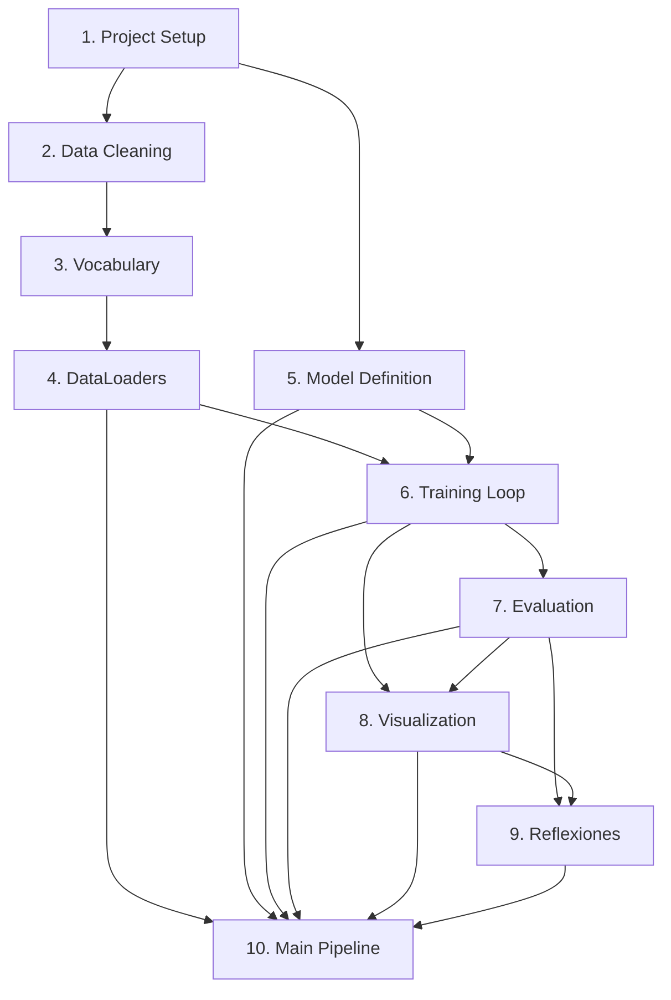

# Implementation Plan: Sentiment Analysis with Stacked RNN

## Overview
Implementation of a modular sentiment analysis system comparing LSTM and GRU architectures on the IMDB dataset. The pipeline covers data acquisition, vocabulary construction, model definition, training with gradient monitoring, evaluation, visualization, and automated reflection document generation.

## Tasks

- [x] 1. Project Setup and Configuration {req:9.1, 9.2, 9.5, 9.6, 9.7}
  - [x] 1.1. Create `config.py` with all centralized hyperparameters
  - [x] 1.2. Create `requirements.txt` with pinned versions (torch, datasets, numpy, matplotlib, seaborn, scikit-learn, pytest, hypothesis)
  - [x] 1.3. Create empty module files: `data.py`, `model.py`, `train.py`, `evaluate.py`, `visualize.py`, `reflexiones.py`, `main.py`
  - [x] 1.4. Create `outputs/` and `checkpoints/` directories with .gitkeep
  - [x] 1.5. Create `tests/` directory with `__init__.py`
  - [x] 1.6. Add tests that validate config values and project structure
  - [x] 1.7. Create Python virtual environment (`.venv/`) and install dependencies from `requirements.txt`
  - [x] 1.8. Create `.gitignore` excluding `.venv/`, `__pycache__/`, IDE files, OS files, and generated outputs
  - [x] 1.9. Verify the build passes
- [x] 2. Data Acquisition and Cleaning Module {req:1.1, 1.2, 1.3, 1.4, 1.5, 1.6} [depends:1]
  - [x] 2.1. Implement `clean_text(text)` in `data.py`: remove HTML tags, lowercase, remove punctuation, tokenize by spaces
  - [x] 2.2. Implement dataset download using Hugging Face `datasets` with error handling
  - [x] 2.3. Add tests for clean_text (HTML removal, lowercase, punctuation, tokenization)
  - [x] 2.4. Verify the build passes
- [x] 3. Vocabulary Construction {req:2.1, 2.2, 2.3, 2.4, 2.5, 2.6} [depends:2]
  - [x] 3.1. Implement `Vocabulary` class with `__init__`, `build`, and `encode` methods
  - [x] 3.2. Enforce PAD=0 and UNK=1 (mandatory order), filter by min_freq=2, cap at 25000
  - [x] 3.3. Implement bidirectional mappings (word2idx, idx2word)
  - [x] 3.4. Add tests for vocabulary integrity (Property 1)
  - [x] 3.5. Verify the build passes
- [x] 4. Sequence Preparation and DataLoaders {req:3.1, 3.2, 3.3, 3.4, 3.5, 3.6} [depends:3]
  - [x] 4.1. Implement `pad_sequence(encoded, max_len)`: truncate or pad to exactly 200
  - [x] 4.2. Implement `IMDBDataset` class with `__len__` and `__getitem__`
  - [x] 4.3. Implement `get_dataloaders(batch_size, seed)`: orchestrate full data pipeline with 20K/5K/25K split
  - [x] 4.4. Add tests for sequence invariants (Property 2) and DataLoader configuration
  - [x] 4.5. Verify the build passes
- [x] 5. Model Definition {req:4.1, 4.2, 4.3, 4.4, 4.5, 4.6} [depends:1]
  - [x] 5.1. Implement `SentimentRNN(nn.Module)` with configurable rnn_type (LSTM/GRU)
  - [x] 5.2. Include embedding (25000x128), stacked RNN (2 layers, 256 hidden, 0.3 dropout), embed dropout (0.5), linear (256→1)
  - [x] 5.3. Use last time step hidden state from final layer; raise ValueError for invalid rnn_type
  - [x] 5.4. Implement `print_model_summary()` showing architecture AND parameters together
  - [x] 5.5. Add tests for model consistency (Property 4) and error handling
  - [x] 5.6. Verify the build passes
- [x] 6. Training Loop with Early Stopping and Gradient Monitoring {req:5.1, 5.2, 5.3, 5.4, 5.5, 5.6, 5.7, 5.8, 5.9, 7.3} [depends:4,5]
  - [x] 6.1. Implement `set_seed(seed)` and `get_device()` in `train.py`
  - [x] 6.2. Implement `TrainingHistory` dataclass
  - [x] 6.3. Implement `train_model()` with BCEWithLogitsLoss, Adam (lr=0.001), gradient clipping (max_norm=5.0)
  - [x] 6.4. Add validation evaluation per epoch, early stopping (patience=3), best checkpoint saving
  - [x] 6.5. Record gradient L2 norms per layer for steps 1-100
  - [x] 6.6. Add tests for determinism (Property 3) and early stopping (Property 5)
  - [x] 6.7. Verify the build passes
- [x] 7. Evaluation and Metrics Module {req:6.1, 6.2, 6.3, 6.4, 6.5} [depends:6]
  - [x] 7.1. Implement `EvaluationResults` dataclass in `evaluate.py`
  - [x] 7.2. Implement `evaluate_model()`: load checkpoint, eval mode, no_grad, sigmoid > 0.5, sklearn metrics
  - [x] 7.3. Implement `print_comparison_table()` for side-by-side LSTM vs GRU results
  - [x] 7.4. Add tests for metrics integrity (Property 6)
  - [x] 7.5. Verify the build passes
- [x] 8. Visualization Module {req:7.1, 7.2, 7.3, 7.4, 7.5} [depends:6,7]
  - [x] 8.1. Implement `plot_training_curves()`: overlaid loss and accuracy (LSTM vs GRU)
  - [x] 8.2. Implement `plot_confusion_matrices()`: side-by-side heatmaps
  - [x] 8.3. Implement `plot_gradient_norms()`: L2 norm per layer, steps 1-100
  - [x] 8.4. Implement `save_all_plots()`: save all as PNG in outputs/
  - [x] 8.5. Add tests that validate plot files are generated
  - [x] 8.6. Verify the build passes
- [x] 9. Reflexiones Document Generator {req:8.1, 8.2, 8.3, 8.4} [depends:7,8]
  - [x] 9.1. Implement `generate_reflexiones()` in `reflexiones.py`
  - [x] 9.2. Address all 8 reflection questions with experimental evidence
  - [x] 9.3. Include quantitative LSTM vs GRU comparisons and gradient analysis
  - [x] 9.4. Add tests that validate REFLEXIONES.md structure and content
  - [x] 9.5. Verify the build passes
- [x] 10. Main Pipeline Orchestrator {req:9.3, 9.4} [depends:4,5,6,7,8,9]
  - [x] 10.1. Implement `verify_setup()`: check all modules exist, raise error if incomplete
  - [x] 10.2. Implement `main()`: full pipeline orchestration with seed=42 before any stochastic operation
  - [x] 10.3. Add integration test with small subset (100 samples, 2 epochs)
  - [x] 10.4. Verify the build passes

## Task Dependency Graph



```json
{
  "waves": [
    {"wave": 1, "tasks": [1]},
    {"wave": 2, "tasks": [2, 5]},
    {"wave": 3, "tasks": [3]},
    {"wave": 4, "tasks": [4]},
    {"wave": 5, "tasks": [6]},
    {"wave": 6, "tasks": [7]},
    {"wave": 7, "tasks": [8]},
    {"wave": 8, "tasks": [9]},
    {"wave": 9, "tasks": [10]}
  ]
}
```

## Notes
- Tasks 1 and 5 can be worked on in parallel (no dependency between them)
- Tasks 2→3→4 form the data pipeline chain
- Task 6 requires both the data pipeline (Task 4) and model (Task 5) to be complete
- The full pipeline test in Task 10 uses a small subset to avoid long training times during testing
