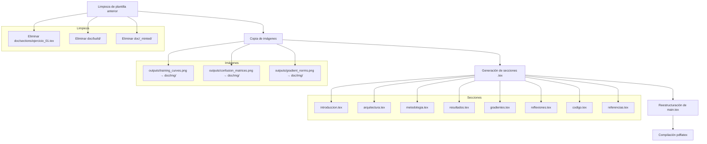
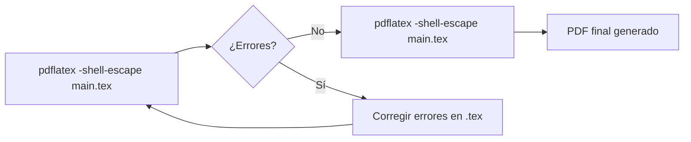

# Design

## Overview

El sistema genera un reporte técnico en LaTeX a partir de los resultados experimentales del proyecto Stacked RNN. El proceso consiste en: (1) limpiar artefactos de la plantilla anterior, (2) copiar imágenes generadas al directorio `doc/img/`, (3) crear 8 archivos `.tex` en `doc/sections/`, (4) reestructurar `main.tex` para incluir las nuevas secciones, y (5) compilar el documento completo con `pdflatex -shell-escape`.

El diseño se integra con la estructura LaTeX existente (`preamble.tex`, `format.tex`, `config.tex`) sin modificarla, y produce todo el contenido en español.

## Architecture



## Components and Interfaces

### Componente 1: Limpieza de plantilla anterior

**Propósito:** Eliminar archivos del proyecto anterior y artefactos de compilación para partir de un estado limpio.

**Acciones:**
- Eliminar `doc/sections/ejercicio_01.tex`
- Eliminar recursivamente `doc/build/`
- Eliminar recursivamente `doc/_minted/`

**Archivos preservados (sin modificación):**
- `doc/preamble.tex` — paquetes: amsmath, amssymb, graphicx, float, booktabs, minted, fancyvrb, babel spanish
- `doc/format.tex` — geometry, hyperref, fancyhdr
- `doc/config.tex` — metadatos del curso (universidad, materia, profesor, etc.)
- `doc/img/logo.png` — logo institucional para la portada

### Componente 2: Copia de imágenes

**Propósito:** Trasladar las figuras generadas por el pipeline de Python al directorio accesible por LaTeX.

**Mapeo de archivos:**

| Origen | Destino |
|--------|---------|
| `outputs/training_curves.png` | `doc/img/training_curves.png` |
| `outputs/confusion_matrices.png` | `doc/img/confusion_matrices.png` |
| `outputs/gradient_norms.png` | `doc/img/gradient_norms.png` |

**Ruta de referencia en LaTeX:** `img/<nombre_archivo>` (relativa a `doc/`).

### Componente 3: Generación de secciones

**Propósito:** Crear los 8 archivos `.tex` que componen el cuerpo del reporte.

Cada archivo se genera en `doc/sections/` y se incluye desde `main.tex` mediante `\input{sections/<nombre>}`.

### Componente 4: Reestructuración de main.tex

**Propósito:** Actualizar el documento principal para incluir las nuevas secciones en orden.

**Estructura resultante de `main.tex`:**

```latex
\documentclass[12pt,letterpaper]{article}

\input{preamble}
\input{config}
\input{format}

\begin{document}

% -------------------- PORTADA --------------------
% [portada existente sin cambios]

\tableofcontents
\newpage

% -------------------- SECCIONES --------------------
\input{sections/introduccion}
\newpage
\input{sections/arquitectura}
\newpage
\input{sections/metodologia}
\newpage
\input{sections/resultados}
\newpage
\input{sections/gradientes}
\newpage
\input{sections/reflexiones}
\newpage
\input{sections/codigo}
\newpage
\input{sections/referencias}

\end{document}
```

### Componente 5: Compilación

**Propósito:** Verificar que el documento compila sin errores fatales.

**Comando:** `pdflatex -shell-escape main.tex` ejecutado desde `doc/`.

**Criterio de éxito:** Código de salida 0, sin líneas con prefijo `!` en la salida. Los warnings son aceptables.

**Nota:** Se requiere `-shell-escape` para el paquete `minted` (resaltado de sintaxis con Pygments).

## Data Models

### Estructura de contenido por sección

#### `introduccion.tex` — Introducción y Marco Teórico

1. **Introducción al problema:** Clasificación binaria de sentimiento en reseñas IMDB, motivación para usar RNN en texto secuencial.
2. **Notación matemática:** Definición de matrices de pesos $W$, $U$, vectores de bias $b$, funciones de activación $\sigma$ y $\tanh$.
3. **Ecuaciones LSTM** (5 ecuaciones en entorno `equation` + `aligned`):
   - Compuerta de olvido: $f_t = \sigma(W_f x_t + U_f h_{t-1} + b_f)$
   - Compuerta de entrada: $i_t = \sigma(W_i x_t + U_i h_{t-1} + b_i)$
   - Candidato de celda: $\tilde{c}_t = \tanh(W_c x_t + U_c h_{t-1} + b_c)$
   - Estado de celda: $c_t = f_t \odot c_{t-1} + i_t \odot \tilde{c}_t$
   - Compuerta de salida y estado oculto: $o_t = \sigma(W_o x_t + U_o h_{t-1} + b_o)$, $h_t = o_t \odot \tanh(c_t)$
4. **Ecuaciones GRU** (4 ecuaciones):
   - Compuerta de reset: $r_t = \sigma(W_r x_t + U_r h_{t-1} + b_r)$
   - Compuerta de actualización: $z_t = \sigma(W_z x_t + U_z h_{t-1} + b_z)$
   - Candidato oculto: $\tilde{h}_t = \tanh(W_h x_t + U_h (r_t \odot h_{t-1}) + b_h)$
   - Estado oculto: $h_t = (1 - z_t) \odot h_{t-1} + z_t \odot \tilde{h}_t$
5. **Stacked RNN:** Explicación del apilamiento — la salida $h_t^{(l)}$ de la capa $l$ alimenta la entrada de la capa $l+1$, permitiendo representaciones jerárquicas.

#### `arquitectura.tex` — Arquitectura del Modelo

1. **Descripción de SentimentRNN:** Modelo configurable que soporta LSTM y GRU.
2. **Capa de embedding:** Vocabulario 25,000 tokens → dimensión 128.
3. **Capas recurrentes:** 2 capas apiladas, 256 unidades ocultas por capa.
4. **Regularización:** Dropout 0.5 post-embedding, dropout 0.3 entre capas RNN.
5. **Capa de clasificación:** Lineal 256 → 1, recibe estado oculto final.
6. **Inicialización:** Bias de compuerta de olvido LSTM a 1.0 (Jozefowicz et al., 2015).
7. **Tabla de arquitectura** (entorno `table` con `booktabs`):

| Capa | Tipo | Entrada | Salida | Parámetros |
|------|------|---------|--------|------------|
| Embedding | `nn.Embedding` | 25,000 | 128 | 3,200,000 |
| Dropout (embed) | `nn.Dropout(0.5)` | 128 | 128 | 0 |
| RNN Capa 1 | LSTM/GRU | 128 | 256 | LSTM: 394,240 / GRU: 295,680 |
| RNN Capa 2 | LSTM/GRU | 256 | 256 | LSTM: 525,312 / GRU: 393,984 |
| Lineal | `nn.Linear` | 256 | 1 | 257 |

#### `metodologia.tex` — Metodología de Entrenamiento

1. **Preprocesamiento:** Dataset IMDB (25K train → 20K train + 5K val, seed=42), limpieza HTML, minúsculas, eliminación no-alfa, tokenización por espacios, vocabulario (max 25K, freq min 2), padding/truncamiento a 200 tokens.
2. **Optimizador:** Adam (lr=0.001, β1=0.9, β2=0.999).
3. **Función de pérdida:** BCEWithLogitsLoss, umbral 0.5 sobre sigmoide.
4. **Early stopping:** Monitorea val_loss, patience=5, máximo 10 épocas.
5. **Gradient clipping:** Norma L2 máxima 5.0, aplicado post-backward, pre-optimizer.step().
6. **Reproducibilidad:** seed=42 (Python random, NumPy, PyTorch CPU/CUDA, cuDNN determinístico), batch_size=64.
7. **Conjunto de prueba:** 25,000 muestras (split test IMDB), monitoreo de gradientes primeros 100 pasos.

#### `resultados.tex` — Resultados Experimentales

1. **Tabla comparativa** (booktabs): Accuracy, Precision, Recall, F1-Score para LSTM y GRU (2 decimales, formato porcentual).
2. **Tiempos de entrenamiento:** LSTM: 71.9s en 4 épocas, GRU: 994.0s en 10 épocas.
3. **Figura `training_curves.png`:** Curvas de pérdida y accuracy por época. `\label{fig:training_curves}`.
4. **Figura `confusion_matrices.png`:** Matrices de confusión. `\label{fig:confusion_matrices}`.
5. **Figura `gradient_norms.png`:** Normas de gradiente por capa. `\label{fig:gradient_norms}`.
6. **Análisis textual:** Interpretación de resultados, comparación entre modelos.

#### `gradientes.tex` — Análisis de Gradientes

1. **Normas promedio:** LSTM: 0.018461, GRU: 0.061758 (primeros 100 pasos).
2. **Ausencia de vanishing/exploding:** Normas > 1×10⁻⁷ y < 5.0 (umbral de clipping).
3. **Rol de compuertas:** LSTM (3: entrada, olvido, salida) vs GRU (2: reset, actualización).
4. **Tabla/lista de normas por capa:** weight_ih, weight_hh, bias — media y máximo para ambos modelos.
5. **Referencia a figura:** `gradient_norms.png` con `\label` y `\caption`.

#### `reflexiones.tex` — Reflexiones y Discusión

8 subsecciones (`\subsection`), una por pregunta de REFLEXIONES.md:
1. Efecto del número de capas apiladas
2. Impacto del dropout entre capas RNN
3. Comparación de velocidad de convergencia LSTM vs GRU
4. Diferencias en el flujo de gradientes
5. Efecto de la longitud de secuencia (padding/truncamiento)
6. Papel de la capa de embedding
7. Efectividad del early stopping
8. Trade-offs entre LSTM y GRU

Cada subsección incluye: comparación explícita LSTM vs GRU y al menos un valor numérico experimental.

**Conclusión general:** Modelo con mejor F1 (GRU: 86.81%), efectividad de regularización, estabilidad de gradientes.

#### `codigo.tex` — Fragmentos de Código Fuente

Fragmentos seleccionados con `minted` (Python), cada uno de 15-40 líneas, con comentario de encabezado y descripción textual.

#### `referencias.tex` — Bibliografía

Entorno `thebibliography` con `\bibitem`. Mínimo 3 fuentes obligatorias + adicionales relevantes.

## Estrategia de Selección de Fragmentos de Código

Los fragmentos se seleccionan por relevancia para la explicación de cada sección. Cada fragmento cubre una sola responsabilidad funcional.

### Fragmentos planificados

| # | Archivo fuente | Líneas aprox. | Contenido | Sección destino |
|---|---------------|---------------|-----------|-----------------|
| 1 | `src/model.py` | 27-62 | Clase `SentimentRNN.__init__` — definición de capas (embedding, RNN, fc) | arquitectura.tex |
| 2 | `src/model.py` | 64-75 | Inicialización del bias de forget gate a 1.0 | arquitectura.tex |
| 3 | `src/model.py` | 77-99 | Método `forward` — flujo de datos embedding → RNN → fc | arquitectura.tex |
| 4 | `src/train.py` | 108-120 | Configuración de criterion (BCEWithLogitsLoss) y optimizer (Adam) | metodologia.tex |
| 5 | `src/train.py` | 143-163 | Bucle de entrenamiento: forward, backward, gradient monitoring | metodologia.tex |
| 6 | `src/train.py` | 165-168 | Gradient clipping (`clip_grad_norm_`) | metodologia.tex |
| 7 | `src/train.py` | 192-210 | Early stopping: comparación val_loss, guardado de checkpoint | metodologia.tex |
| 8 | `src/data.py` | 12-30 | Función `clean_text` — preprocesamiento de texto | metodologia.tex |
| 9 | `src/data.py` | 68-78 | Función `pad_sequence` — truncamiento y padding | metodologia.tex |
| 10 | `src/evaluate.py` | 55-80 | Inferencia: carga de checkpoint, forward sin gradientes, sigmoid > 0.5 | resultados.tex |

**Reglas de selección:**
- Máximo 40 líneas por fragmento; si excede, dividir con párrafo explicativo intermedio.
- Cada fragmento lleva un comentario `% --- Descripción ---` antes del entorno `minted`.
- Los fragmentos se presentan inline en la sección donde apoyan la explicación.
- Se omiten imports, docstrings extensos y código repetitivo.

## Convenciones LaTeX

### Ecuaciones
- Entorno `equation` para ecuaciones principales (numeradas automáticamente).
- Entorno `aligned` dentro de `equation` para sistemas de ecuaciones.
- Etiquetas con prefijo `eq:` (e.g., `\label{eq:lstm_forget}`).
- Referencias con `\eqref{eq:...}` en el texto.

### Tablas
- Paquete `booktabs`: `\toprule`, `\midrule`, `\bottomrule`.
- Entorno `table` con posicionamiento `[H]` (paquete `float`).
- `\caption` descriptivo + `\label{tab:...}`.
- Al menos una referencia cruzada `\ref{tab:...}` en el texto previo.

### Figuras
- Entorno `figure` con posicionamiento `[H]`.
- `\includegraphics[width=0.9\textwidth]{img/<nombre>}`.
- `\caption` descriptivo + `\label{fig:...}`.
- Al menos una referencia cruzada `\ref{fig:...}` en el texto previo.

### Código fuente
- Entorno `minted{python}` con configuración global del preámbulo (linenos, breaklines, frame=single, fontsize=\small).
- Comentario de encabezado antes de cada bloque: `% --- Título funcional ---`.
- Párrafo descriptivo de 1-3 oraciones antes de cada fragmento.

### Bibliografía
- Entorno `thebibliography` (sin BibTeX externo).
- Entradas `\bibitem{clave}` con formato autor-año.
- Citadas en texto con `\cite{clave}`.
- Fuentes obligatorias:
  - `\bibitem{hochreiter1997}` — Hochreiter & Schmidhuber (1997). Long Short-Term Memory.
  - `\bibitem{cho2014}` — Cho et al. (2014). Learning Phrase Representations using RNN Encoder-Decoder.
  - `\bibitem{jozefowicz2015}` — Jozefowicz et al. (2015). An Empirical Exploration of Recurrent Network Architectures.

### Idioma y estilo
- Todo el contenido en español.
- Paquete `babel` con opción `spanish,es-nodecimaldot` (ya configurado en preámbulo).
- Uso de comandos de `config.tex` (`\titulo`, `\materia`, `\profesor`, `\semestre`, `\autorA`) donde corresponda — no valores literales.

## Flujo de Compilación



**Pasos de compilación:**
1. Ejecutar `pdflatex -shell-escape main.tex` desde `doc/` (primera pasada — genera TOC y referencias).
2. Ejecutar `pdflatex -shell-escape main.tex` (segunda pasada — resuelve referencias cruzadas y TOC).
3. Verificar: código de salida 0, sin líneas `!` en log.

**Dependencias del sistema:**
- `pdflatex` con distribución TeX completa (TeX Live o MiKTeX).
- Python 3 + Pygments (requerido por `minted` para resaltado de sintaxis).
- El flag `-shell-escape` es obligatorio para que `minted` invoque Pygments.

## Correctness Properties

*Since this feature generates static LaTeX documents from fixed experimental data (not a function with variable input space), formal property-based testing does not apply. Instead, the following verifiable correctness properties can be checked via shell commands or scripts.*

### Property 1: Structural completeness

All 8 expected `.tex` files exist in `doc/sections/` after generation: `introduccion.tex`, `arquitectura.tex`, `metodologia.tex`, `resultados.tex`, `gradientes.tex`, `reflexiones.tex`, `codigo.tex`, `referencias.tex`.

**Validates: Requirements 8.1**

### Property 2: Compilation success

`pdflatex -shell-escape main.tex` completes with exit code 0 and no fatal errors (lines starting with `!`).

**Validates: Requirements 8.3**

### Property 3: Image availability

All 3 required images (`training_curves.png`, `confusion_matrices.png`, `gradient_norms.png`) exist in `doc/img/` before compilation.

**Validates: Requirements 8.5**

### Property 4: Template cleanup

`ejercicio_01.tex`, `doc/build/`, and `doc/_minted/` are removed after the cleanup step.

**Validates: Requirements 8.6, 8.7**

### Property 5: Reference resolution

Second compilation pass produces no "undefined reference" warnings in the log.

**Validates: Requirements 9.3, 9.4, 9.6**

### Property 6: Content integrity

Each section file is non-empty and contains at least one `\section` or `\subsection` command.

**Validates: Requirements 8.1**

## Error Handling

| Escenario | Acción |
|-----------|--------|
| Imagen faltante en `outputs/` | Error: no generar sección de resultados parcial. Indicar qué imagen falta. |
| `REFLEXIONES.md` incompleto (< 8 secciones) | Error: no generar `reflexiones.tex` parcial. Listar secciones faltantes. |
| Error de compilación LaTeX (línea con `!`) | Identificar archivo y línea, corregir sintaxis. |
| Paquete LaTeX faltante | Indicar paquete requerido; no modificar `preamble.tex`. |
| Fragmento de código > 40 líneas | Dividir en sub-fragmentos con párrafo explicativo intermedio. |

## Testing Strategy

**Nota sobre Property-Based Testing:** Esta funcionalidad NO es adecuada para PBT. Se trata de generación de documentos estáticos a partir de datos fijos — no hay una función con espacio de entrada variable donde propiedades universales apliquen. La verificación se realiza mediante:

1. **Verificación de compilación:** `pdflatex -shell-escape main.tex` debe completar con código 0 y sin errores fatales (líneas `!`).
2. **Verificación de estructura:** Confirmar existencia de los 8 archivos en `doc/sections/`.
3. **Verificación de contenido:** Cada sección contiene los elementos requeridos (ecuaciones, tablas, figuras, fragmentos de código) según los acceptance criteria.
4. **Verificación de limpieza:** `ejercicio_01.tex`, `doc/build/`, `doc/_minted/` eliminados.
5. **Verificación de imágenes:** Las 3 imágenes existen en `doc/img/`.
6. **Verificación de referencias cruzadas:** Segunda compilación resuelve todas las `\ref` y `\eqref` (sin warnings de "undefined reference" en el log).

Estas verificaciones se ejecutan como pasos manuales o scripts de shell simples, no como tests unitarios o de propiedad.
